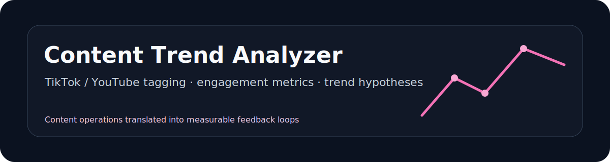
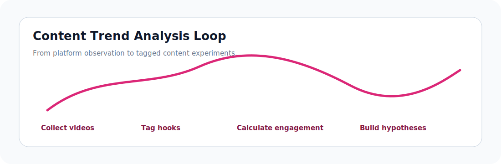
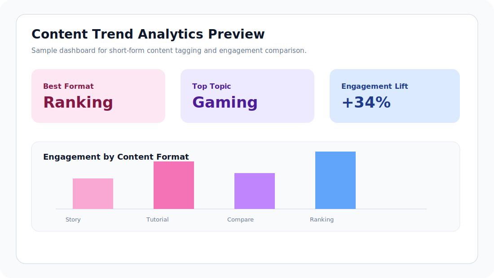

<p align="center">
  
</p>

<p align="center">
  
  
  
</p>

# TikTok / YouTube Content Trend Analyzer

A content analytics project for studying short-form video trends, engagement patterns, topic tags, and repeatable content hypotheses.

## At a Glance

| Item | Detail |
| --- | --- |
| Role fit | AI operations, content operations, product analytics |
| Core value | Turns content observations into a measurable trend analysis workflow |
| Main skills | Tag taxonomy, engagement metrics, qualitative-to-quantitative analysis |
| Recruiter signal | Understands platform feedback loops and content experimentation |

## Workflow Preview

<p align="center">
  
</p>

## Screenshot & Data Output

<p align="center">
  
</p>

- Sample metrics dataset: [`data/sample_content_metrics.csv`](data/sample_content_metrics.csv)
- Trend report: [`reports/trend-report.md`](reports/trend-report.md)

## Project Background

Short-form content platforms reward fast testing, clear positioning, and strong feedback loops. This project packages my experience with TikTok, YouTube, and overseas content platforms into a structured analytics workflow.

## Problem I Solved

Creators and product teams often know that a video is popular, but not why. This project creates a simple framework to label content, compare engagement rates, and summarize patterns that can guide future content decisions.

## Tools & Tech Stack

- Python for data cleaning and metric calculation.
- Excel for quick tagging and manual review.
- Power BI concept dashboard for content performance.
- AI tools for tag taxonomy drafting and insight summarization.

## Core Features

- Content tagging framework.
- Engagement rate calculation.
- Hook, format, topic, and audience label design.
- Trend summary report.
- Content experiment backlog.

## Project Highlights

- Focuses on decision-making, not scraping for its own sake.
- Separates observable metrics from subjective content interpretation.
- Turns content observations into testable hypotheses.

## Data / AI / Product Thinking

- Data analytics: engagement rate, content grouping, comparative analysis.
- AI workflow: uses AI to draft tag taxonomies and summarize qualitative observations.
- Product thinking: treats each content format as an MVP experiment with measurable feedback.

## Outcome

The project demonstrates how content platform experience can be converted into analytics and product operations thinking.

## Repository Structure

```text
content-trend-analyzer/
├── README.md
├── data/
│   └── sample_content_metrics.csv
├── notebooks/
├── src/
│   └── engagement_metrics.py
├── reports/
│   └── trend-report.md
├── dashboard/
└── docs/
    └── tagging-framework.md
```

## Resume Bullet

- Built a content trend analysis framework for TikTok and YouTube-style videos, combining tagging, engagement-rate metrics, and AI-assisted insight synthesis to identify repeatable content patterns.

## Next Improvements

- Add a notebook that calculates engagement rate and completion proxy.
- Add a dashboard screenshot for platform comparison.
- Add more examples of content hooks and tag categories.

## Contact

For questions or collaboration: [steventang30999@gmail.com](mailto:steventang30999@gmail.com)
